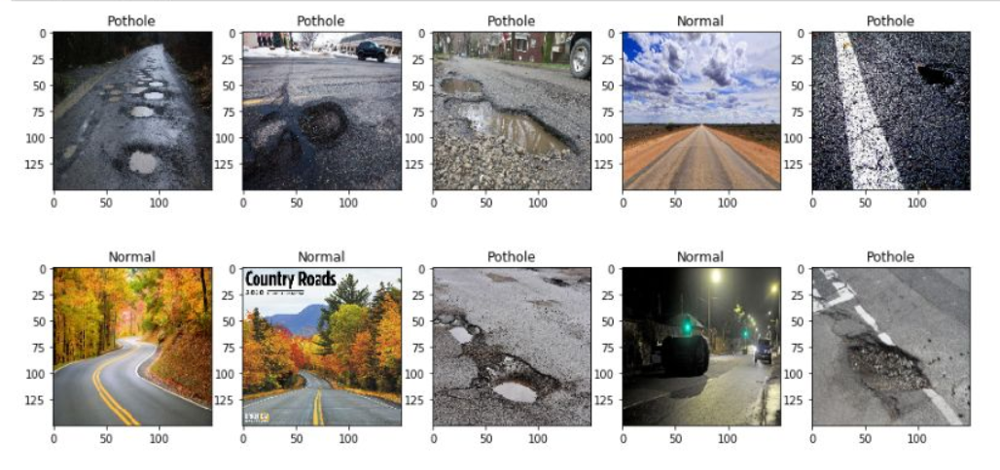
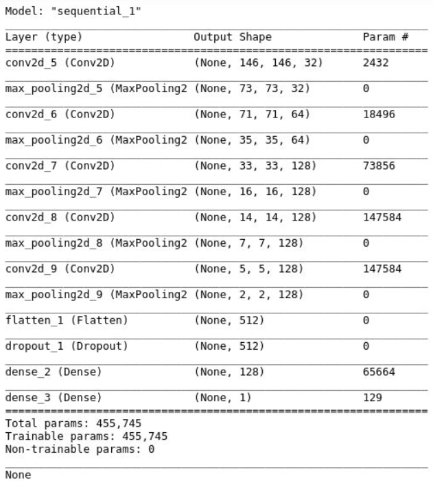
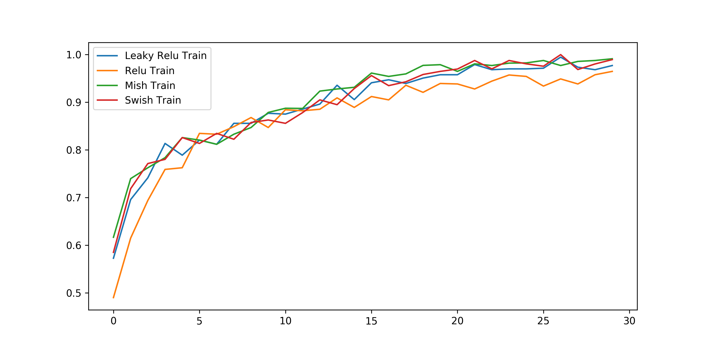
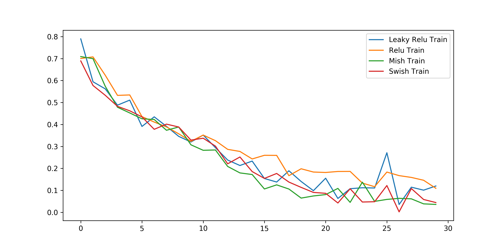
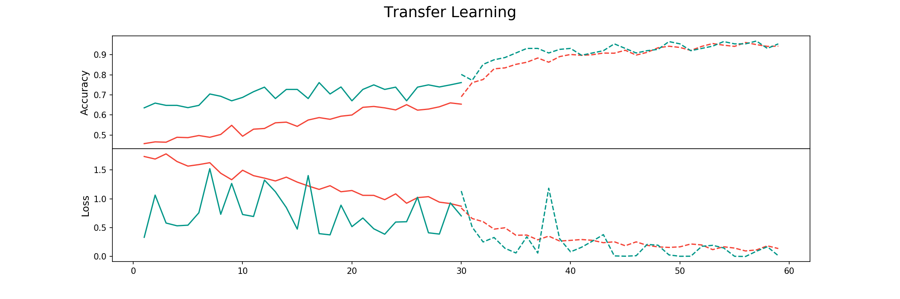

# Pothole Detection  

The purpose of this repository is to explore different methods for creating
an image classification algorithm (pothole detection). 

Several activation functions are explored in custom nets:
* Relu
* Leaky Relu
* Swish 
* Mish

Furthermore, EffecientNetB0 is additionally used and compared on 
how well transfer learning can be used. Finally, this model
is finetuned by unfreezing its top layers after having initially 
trained the model. 

## Table of Contents  
<!--ts-->
   * [Data](#data)
     * [Preprocessing Images](#preprocessing)
   * [Experiment 1 - Activation Functions](#experiment1)
     * [Results](#results1)
   * [Experiment 2 - Transfer Learning](#experiment2)
     * [Results](#results2)
<!--te-->

# To do:
* Add visual of custom CNN

---

##  Data
The data used in this exercise are 681 images of roads that could 
either contain potholes or not. I have split the data into a training
and validation set with 581 and 100 images respectively. Examples of these
images can be found below:

####  Preprocessing
The images are only normalized by dividing their rgb values by 255.
Although the ImageGenerator allows for many different preprocessing
options, I believed that could hinder results when comparing 
the activations. Moreover, they were resized to 150x150.

---

##  Experiment 1 - Activation Functions
To compare different activation functions (Relu, Leaky Relu,
Swish, and Mish), I made a straightforward
custom CNN with different activation functions throughout. 

The general structure of the cnn is as follows:

The models were trained with the following characteristics:
* Trained for 30 epochs 
* Learning rate of .001
* Binary Crossentropy was used
* Accuracy as an objective measure

####  Results
Interestingly, the results seem to indicate that Leaky performs
worst across 30 epochs whereas all other activations seem to be 
performing better. Note, that this could be checked by using
a Wilcoxon signed-rank test to test for the differences between
the curves. 

---

##  Experiment 2 - Transfer Learning
Next, this experiment is mostly exploring the effectiveness of
using a very small network, namely EfficientNetB0, for solving
the problem at hand. 

Here, the process is as follows. First, we take EfficientNetB0
with pretrained weights and remove the top layer. Then, we add
a global max poollayer and a dense layer for making predictions. 
The base model is then set so it cannot be trained in order
to only train the newly added layers. 

After doing so, we take a few layers below the newly added layers
and make them trainable for finetuning the model. 

Each step is trained for 30 epochs, with a learning rate of
2e-5 (RMSProp), and finally a Binary Crossentropy was used a loss
function.  

####  Results
You can see that the curve of the results (accuracy) become higher
when the upper layer were unfrozen and retrained. Although the final
performance is not as high as the initial custom cnns, the model
trains much faster and therefore is likely to more quickly reach
a higher performance. 

---